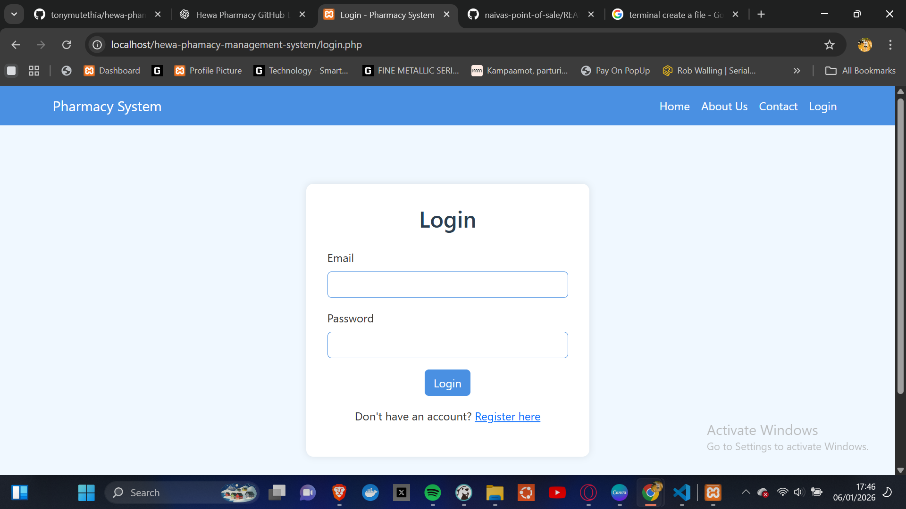
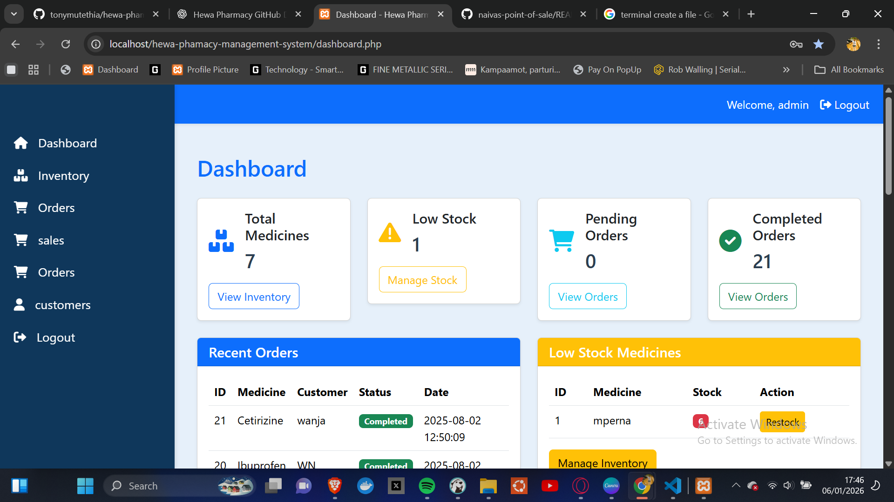
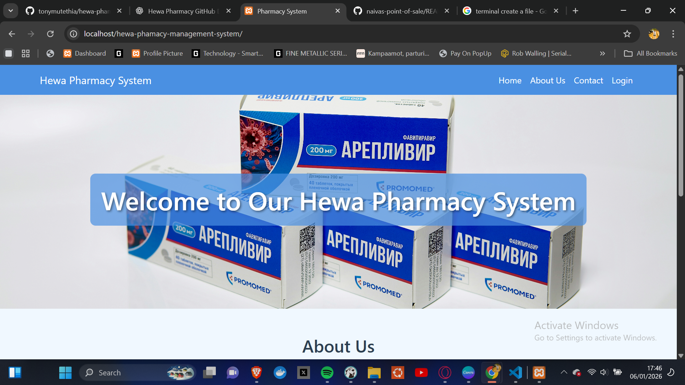
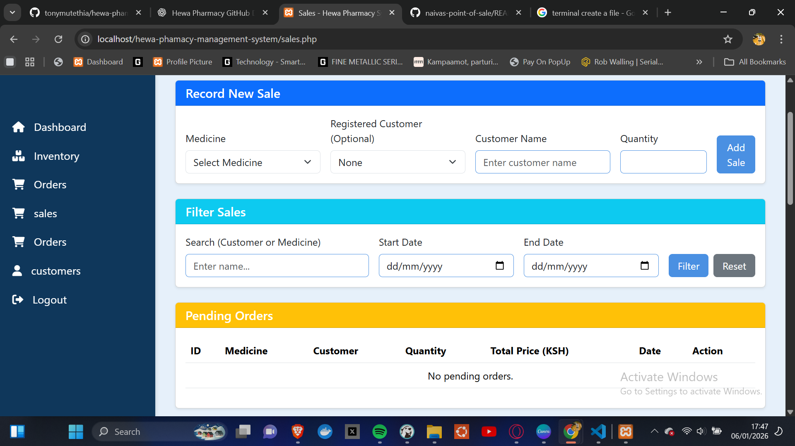

# Hewa Pharmacy Management System

Hewa Pharmacy Management System is a PHP-based application designed to help pharmacies in Kenya manage daily operations efficiently. The system includes features for inventory management, sales tracking, customer records, billing, and reporting.

## Screenshots

### Login Page


### Dashboard


### Home Page


### Sales Page


## Features

- **Inventory Management**: Track medicines, stock levels, and expiry dates.  
- **Sales & Billing**: Generate invoices, manage sales, and update stock automatically.  
- **Customer Records**: Maintain detailed patient information for easy reference.  
- **Reports**: Generate daily, weekly, and monthly sales and stock reports.  
- **User Management**: Admin and staff roles with secure login functionality.  
- **Notifications**: Alerts for low stock or expired medicines.  

## Tech Stack

- **Backend**: PHP  
- **Database**: MySQL  
- **Frontend**: HTML, CSS, Bootstrap  
- **Environment**: XAMPP  

## Installation

1. Clone the repository:  
   ```bash
   git clone https://github.com/tonymutethia/hewa-phamacy-management-system.git
